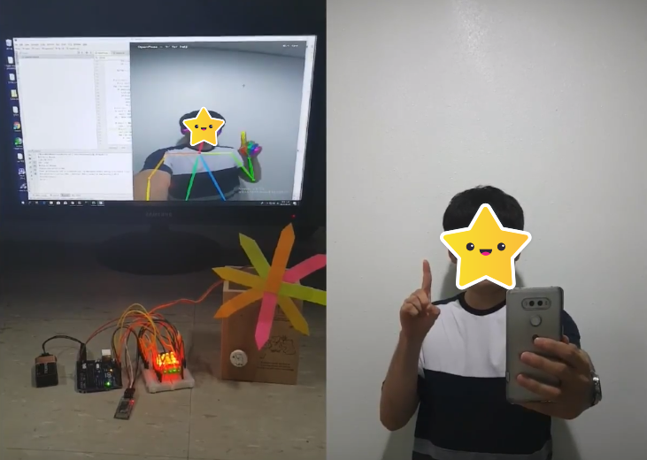
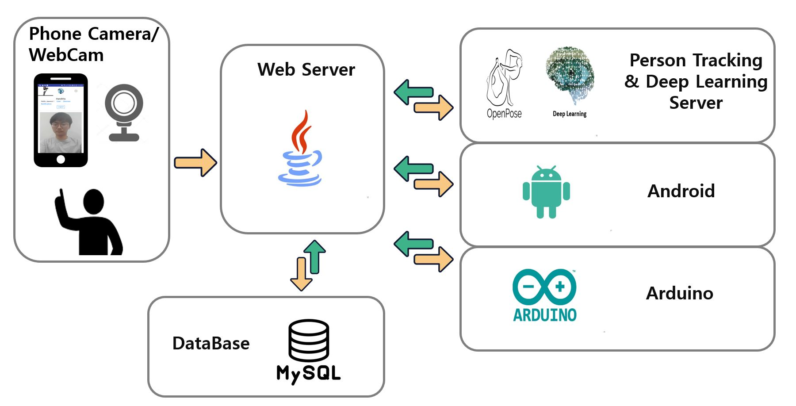

# handvis
사용자의 손동작을 인식하여 IoT 기기를 제어한다. [Youtube Video 보기](https://www.youtube.com/watch?v=a2Fvd71hR1M) 

    

## System

    

- [Web Server](https://github.com/qwebnm7788/handvis) : java/jsp
- [Person Tracking & Deep Learning Server](https://github.com/generation21/Handvis) : openpose/LSTM
- Android : kotlin
- Arduino

## Application implementation
- [main sorce](./app/src/main/java/com/example/kimyounghoon/handvis/) 
- [layout](./app/src/main/res/layout/) 
- [AndroidManifest](.app/src/main/AndroidManifest.xml)
